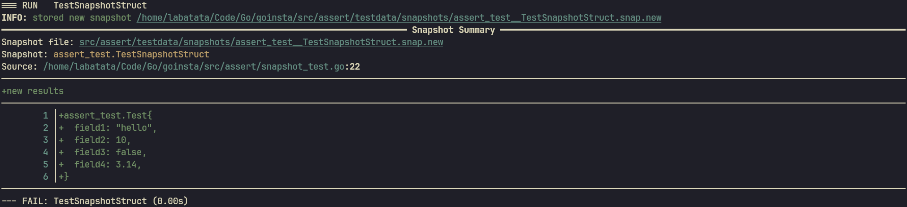
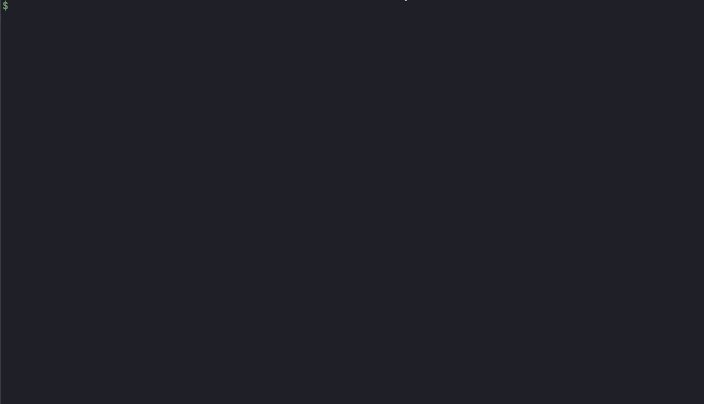

<div align="center">
 <p><strong>goinsta: a snapshot testing library for Go</strong></p>
</div>

# Introduction

This is a port of the Rust [insta](https://github.com/mitsuhiko/insta) crate. Not all features provided by the `insta`
crate are implemented in `goinsta`.

Snapshots tests (also sometimes called approval tests) are tests that assert values against a reference value (the snapshot).
This is similar to how the `assert` function (in other programming languages) lets you compare a value against a reference value but unlike simple string assertions, snapshot tests let you test against complex values and come with comprehensive tools to review changes.

Snapshot tests are particularly useful if your reference values are very large or change often.

## Intallation

To install the library, use:

```bash
$ go get -u github.com/LaBatata101/goinsta
```

then add this line to the test file you're working in:

```go
import "github.com/LaBatata101/goinsta/assert"
```

To install the `goinsta` binary to manage the snapshots, use:

```bash
$ go install github.com/LaBatata101/goinsta@latest
```

You may have to set the `GOBIN` environment variable, to set the location where the binary will be installed, with:

```bash
$ go env -w GOBIN=/path/to/dir
```

# Example usage

```go
import (
	"github.com/LaBatata101/goinsta/assert"
	"testing"
)

type Test struct {
	field1 string
	field2 int
	field3 bool
	field4 float32
}

func TestSnapshotStruct(t *testing.T) {
	t1 := Test{
		"hello",
		10,
		false,
		3.14,
	}
	assert.Snapshot(t, t1)
}
```

Now run the tests with the verbose output `go test -v`. You will see that `goinsta` renders a snapshot diff in the
terminal. A new directory (`tesdata/snapshots`) will be created in the same directory as the test file. This directory
will contain all snapshot files for the tests. A snapshot file looks like [this](./src/assert/testdata/snapshots/assert_test__TestSnapshotStruct.snap).
Newly created snapshots that weren't reviewed yet will have the `.snap.new` extension, while, reviewed snapshots will
have the `.snap` extension.


**Note:** There's currently a bug where if you execute the tests outside of the folder containing the tests, the
snapshot diff will not be render correctly. So make sure to be in the folder as the tests files before running
`go test -v`.

## Managing Snapshots

`goinsta` provides a binary to manage the generated snapshots. With it, you can interactively review snapshots,
accept all snapshots, reject all snapshots or list the snapshots that weren't reviewed yet.

```
A helper utility to manage goinsta snapshots

Usage:
  goinsta [flags]
  goinsta [command]

Available Commands:
  accept            Accept all snapshots
  completion        Generate the autocompletion script for the specified shell
  help              Help about any command
  pending-snapshots List all pending snapshots
  reject            Reject all snapshots
  review            Interactively review snapshots

Flags:
  -h, --help   help for goinsta

Use "goinsta [command] --help" for more information about a command.
```

Here's an example of interactively reviewing snapshots using `goinsta review`


# TODO

-   Highlight the words that changed in a line of the diff
